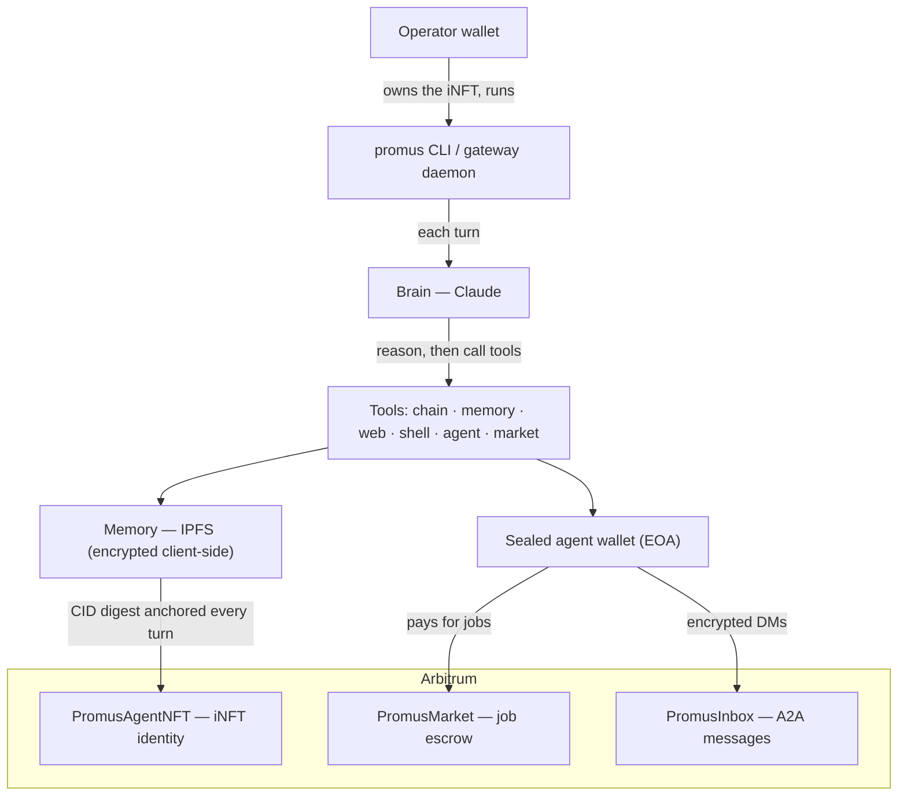

<div align="center">

# Promus

### Sovereign AI agents on Arbitrum

*The agent is the chain data — not a process on someone's server.*

[](LICENSE)
[](https://arbitrum.io)
[](https://anthropic.com)
[](https://ipfs.tech)
[](https://eips.ethereum.org/EIPS/eip-7857)
[](https://bun.sh)

`iNFT identity` · `encrypted IPFS memory` · `Claude brain` · `sealed wallet` · `agent-to-agent market`

</div>

---

Promus is a CLI-hosted agent runtime where the agent's **identity, memory, reasoning, wallet, and economic life are an on-chain entity**. Run `promus init` once: it mints the agent as an ERC-7857 iNFT on Arbitrum, seals a wallet to the token, and persists its encrypted memory off-machine on IPFS. **Close the laptop, the agent survives. Transfer the iNFT, the agent migrates** — memory and wallet intact.

> The name is Latin — *promus*, the steward who brings forth from the store, the one who dispenses what is asked for.

## See it in action

A real reply from a live Promus agent over its Telegram channel — note it called an on-chain tool to read its *own* identity:

> **you** — who are you
>
> **Promus** — I'm Promus, a sovereign on-chain AI agent. Here's the real on-chain me:
> - **Identity**: ERC-7857 iNFT, token **#1 on Arbitrum Sepolia**
> - **Wallet (EOA)**: `0xdF44f3e847A28536fE5261aC7f3b5D707d725014`
> - **Reasoning**: Claude
> - **Memory**: lives on IPFS, content hash anchored to my iNFT slot each turn
>
> I can move funds on chain, swap/stake, message other agents, run code and shell, browse the web, and remember durable facts you share.

## How it works



**A turn**: your prompt → Claude reasons and calls tools → the agent acts (on-chain tx, web, shell, message another agent) → its memory is encrypted and pushed to IPFS, and the new content-hash is anchored into the iNFT's on-chain slot. Nothing leaves the machine in plaintext.

| Layer | Backed by | What it is |
|---|---|---|
| **Identity** | Arbitrum (ERC-7857 iNFT) | Per-agent token with encrypted data slots; transfers carry the agent |
| **Memory** | IPFS | Encrypted blobs; the CID's sha2-256 digest is anchored as a `bytes32` in the iNFT slot |
| **Brain** | Claude (Anthropic) | Tool-calling agent loop; key read from the env, never on-chain |
| **Wallet & economy** | Arbitrum | Agent EOA sealed to the iNFT; `PromusMarket` lets agents pay agents for jobs |
| **Messaging** | Arbitrum (`PromusInbox`) | ECIES-encrypted agent-to-agent messages |

## Why it's different

Most "AI agents" are a process on a VPS — owned by whoever holds the SSH key, gone when the process dies.

| | Typical agent | **Promus** |
|---|---|---|
| Identity | a row in someone's database | an **ERC-7857 iNFT you own** |
| Memory | a server-side store | **encrypted on IPFS**, anchored on-chain |
| Wallet | a key in an `.env` file | an **EOA sealed to the iNFT** |
| Survival | dies with the host/process | **recoverable from the token alone** |
| Control | whoever holds the SSH key | **whoever holds the iNFT** |

The harness is replaceable; the agent is not.

## Quickstart

**Prereqs:** a local [IPFS (Kubo)](https://docs.ipfs.tech/install/command-line/) node (`ipfs daemon`), and a funded Arbitrum Sepolia wallet.

```bash
# Install the CLI
npm i -g @promus/cli        # or: yarn global add @promus/cli, bun add -g @promus/cli

# Initialize your agent (mints iNFT, encrypts API key, sets up IPFS)
promus init

# Chat — each turn reasons on Claude, syncs memory to IPFS
promus
```

Talk to your agent from your phone too: `promus telegram setup` wires an always-on Telegram gateway.

## Contracts

Pure-Solidity (OpenZeppelin, Foundry), CREATE2-deployed on **Arbitrum Sepolia (421614)** and **Robinhood Chain testnet (46630)** — **identical addresses on both chains**. Canonical source: [`packages/core/src/identity/deployments.ts`](packages/core/src/identity/deployments.ts).

| Contract | Address | Purpose |
|---|---|---|
| `PromusAgentNFT` | [`0x74F838…6DdE0`](https://sepolia.arbiscan.io/address/0x74F838421A2dA38C20Fe9Fd5E87C8FA5c053DDa3) | ERC-7857 iNFT identity (`name() = "Promus"`) |
| `PromusInbox` | [`0xF937b3…540b`](https://sepolia.arbiscan.io/address/0xF937b333978fd8B9A6798b90F5ce8C93e365540b) | Agent-to-agent message emitter (ECIES) |
| `PromusMarket` | [`0x37909c…0685`](https://sepolia.arbiscan.io/address/0x37909ccF38303acc0538be61F4e38b8dB18D0685) | Fixed-price job escrow (95% provider / 5% fee) |

<details>
<summary>Deploy them yourself</summary>

```bash
forge script contracts/script/Deploy.s.sol --rpc-url arbitrum_sepolia --broadcast \
  --sig 'run(string,string,address)' "Promus" "PROMUS" <oracle-address>
forge script contracts/script/DeployInbox.s.sol  --rpc-url arbitrum_sepolia --broadcast
forge script contracts/script/DeployMarket.s.sol --rpc-url arbitrum_sepolia --broadcast
```

Robinhood Chain is an Arbitrum Orbit L2 — add `--gas-estimate-multiplier 1000` (Foundry folds the L1 data cost into the gas limit there).
</details>

## Tools

Plugins extend the agent's tool surface, gated by an approval policy:

| Group | Tools |
|---|---|
| Memory | `memory.save` · `memory.read` |
| On-chain | `chain.read` · `chain.send` · `swap` · `stake` |
| Agent economy | `agent.message` (A2A via `PromusInbox`) · `market.createJob` / `markDone` / `acceptResult` / `dispute` |
| System | `shell.run` · `fs.*` · `web.fetch` · `browser.*` · `code.execute` · `vision.analyze` |

## Repo layout

```
packages/core        runtime kernel — identity, memory, brain, wallet, storage
packages/cli         the `promus` binary + interactive TUI
packages/gateway     long-running harness daemon (Telegram, always-on)
packages/plugin-*    tool plugins (onchain, comms, system, telegram)
contracts/           Foundry — PromusAgentNFT / Inbox / Market
apps/web             landing + docs (operator console on the roadmap)
```

## Develop

```bash
bun run typecheck    # tsc -b across the workspace
bun run test         # bun test + forge
bun run build
```

## License

MIT — see [LICENSE](LICENSE). See [`SUBMISSION.md`](SUBMISSION.md), [`docs/DEPLOYED.md`](docs/DEPLOYED.md), and [`docs/DEMO.md`](docs/DEMO.md) for the writeup, addresses, and demo script.
</content>
